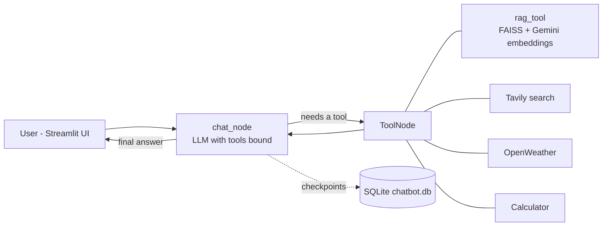

# 🤖 Agentic ChatBot using LangGraph

A tool-using AI chatbot built with **LangGraph** and **Streamlit**. The agent decides on its own when to search your PDF, browse the web, check the weather or do math, and it keeps your conversations saved so you can come back to them later.

## ✨ Features

- **Agentic tool use**: an LLM (Groq `openai/gpt-oss-120b`) chooses the right tool for each question
  - 📄 **PDF Q&A (RAG)**: upload a PDF and ask questions, summaries or explanations about it
  - 🌐 **Web search**: current information via Tavily
  - ⛅ **Live weather**: real-time weather for any city via OpenWeather
  - 🧮 **Calculator**: restricted math evaluation
- **Persistent memory**: every conversation is stored in SQLite, so chats survive page refreshes and restarts
- **Multiple chats**: start new conversations, switch between old ones, delete one or all
- **Streaming responses** with a live status line showing which tool is running
- **Hosted embeddings** (Google Gemini): no local model or PyTorch needed, so it starts fast and uses little RAM

## 🧠 How it works



1. The user's message goes to `chat_node`, where the LLM decides whether to answer directly or call a tool.
2. If a tool is needed, `ToolNode` runs it and sends the result back to the LLM.
3. This loop repeats until the model produces a final answer, which is streamed to the UI.
4. LangGraph's `SqliteSaver` checkpoints each conversation under a `thread_id`, which gives every chat its own memory.

## 🛠️ Tech stack

| Area | Technology |
|---|---|
| Agent framework | LangGraph, LangChain |
| LLM | Groq (`openai/gpt-oss-120b`) |
| Embeddings | Google Gemini (`gemini-embedding-001`) |
| Vector store | FAISS |
| Web search | Tavily |
| Weather | OpenWeather API |
| Memory | SQLite (`langgraph-checkpoint-sqlite`) |
| Frontend | Streamlit |

## 📁 Project structure

```
.
├── app.py              # Streamlit frontend (chat UI, PDF upload, chat history sidebar)
├── backend.py          # LangGraph agent, tools, RAG pipeline, SQLite memory
├── requirements.txt
├── .env                # API keys (not committed)
├── chatbot.db          # Created automatically: saved conversations
└── faiss_db/           # Created automatically: PDF vector index
```

## 🚀 Getting started

### 1. Clone the repo

```bash
git clone https://github.com/<your-username>/Agentic-ChatBot-using-LangGraph.git
cd Agentic-ChatBot-using-LangGraph
```

### 2. Create a virtual environment and install dependencies

```bash
python -m venv venv
# Windows
venv\Scripts\activate
# macOS / Linux
source venv/bin/activate

pip install -r requirements.txt
```

### 3. Add your API keys

Create a `.env` file in the project root:

```env
GROQ_API_KEY=your_groq_key
TAVILY_API_KEY=your_tavily_key
OPENWEATHER_API_KEY=your_openweather_key
GOOGLE_API_KEY=your_google_ai_studio_key
```

| Key | Where to get it |
|---|---|
| `GROQ_API_KEY` | [console.groq.com](https://console.groq.com) |
| `TAVILY_API_KEY` | [tavily.com](https://tavily.com) |
| `OPENWEATHER_API_KEY` | [openweathermap.org/api](https://openweathermap.org/api) |
| `GOOGLE_API_KEY` | [aistudio.google.com/apikey](https://aistudio.google.com/apikey) (free) |

### 4. Run the app

```bash
streamlit run app.py
```

Open the URL shown in the terminal (usually `http://localhost:8501`).

## 💡 Usage

1. **Chat normally**: ask general questions, and the agent answers directly.
2. **Ask about the weather**: *"What's the weather in Mumbai right now?"*
3. **Search the web**: *"Latest news about LangGraph"*
4. **Do math**: *"What is sqrt(144) * 7?"*
5. **Chat with a PDF**: upload a file in the sidebar, then ask *"Summarize this PDF"* or *"Explain question 3"*.
6. **Manage chats**: use **New chat**, click any past conversation to reopen it, or use 🗑 to delete it.

## ⚠️ Notes and limitations

- Uploading a new PDF **replaces** the previous index (one active PDF at a time).
- Scanned PDFs (images without text) can't be read, because the loader extracts text only.
- Changing the embedding model requires deleting the `faiss_db/` folder and re-uploading your PDF.
- Gemini's free tier has rate limits, so very large PDFs may hit quota errors while indexing.
- On hosts with temporary disks (such as free Render or Streamlit Community Cloud plans), `chatbot.db` and `faiss_db/` are wiped on restart or redeploy.
- The calculator uses a restricted `eval`. Replace it with a dedicated math parser before exposing the app publicly.

## ☁️ Deployment

**Streamlit Community Cloud**: connect the repo, set the main file to `app.py`, and add the four keys under **Secrets**.

**Render**:
- Build command: `pip install -r requirements.txt`
- Start command: `streamlit run app.py --server.port $PORT --server.address 0.0.0.0 --server.headless true`
- Add the four keys under **Environment**.

## 🗺️ Roadmap

- [ ] Support multiple PDFs at once
- [ ] Long-term user memory across chats
- [ ] Source citations with page numbers in answers
- [ ] Safer math parser

## 📄 License

Distributed under the Apache License 2.0. See [`LICENSE`](LICENSE) for details.
